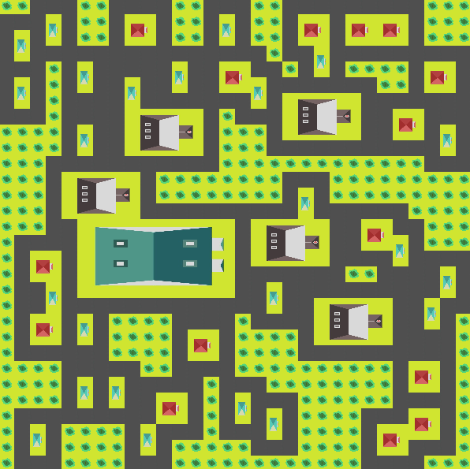
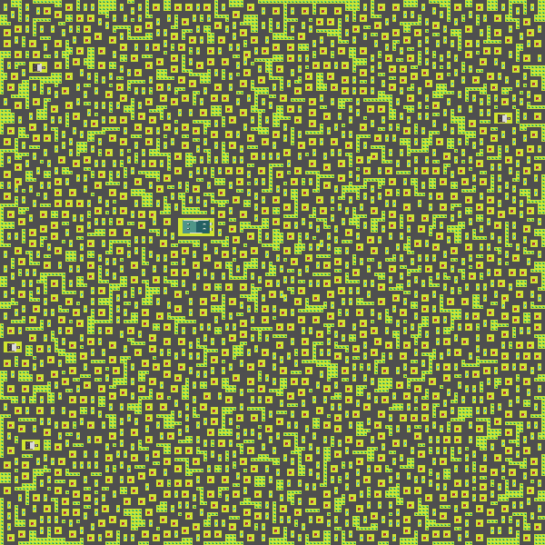

## Case Base Method Algorithm Kelompok 11

| NIM          | Nama                    | Role                  |
|--------------|-------------------------|-----------------------|
| 2001020061   | Rafli Hidayat           | Project Manager       |
| 2101020069   | Muhammad Raihan Yunus   | -                     |
| 2201020023   | Mohd. Allifyan Baitulnesam | Design Asset                 |
| 2201020034   | Monalisa                | -                     |
| 2201020046   | Alvira Angraini         | Technical Writer      |

## Hasil Sementara
Dalam ukuran kecil

## Hasil Sementara
Dalam ukuran 150x150

## Catatan Proyek

**Perhatian**: Proyek ini sudah hampir selesai dan akan diunggah (upload) dalam waktu dekat. Kami sedang melakukan penyelesaian terakhir dan pembersihan kode sebelum kami merilis versi stabilnya. Terima kasih atas kesabaran dan dukungan Anda.

Stay tuned!

## Kontributor
- [Tekad Matulatan, S.Sos., S.Kom., M.Inf.Tech](https://github.com/Matulatan-Tekad)
- [2001020061](https://github.com/2001020061)
- [2101020069](https://github.com/2101020069)
- [2201020023](https://github.com/2201020023)
- [2201020034](https://github.com/2201020034)
- [2201020046](https://github.com/2201020046)
